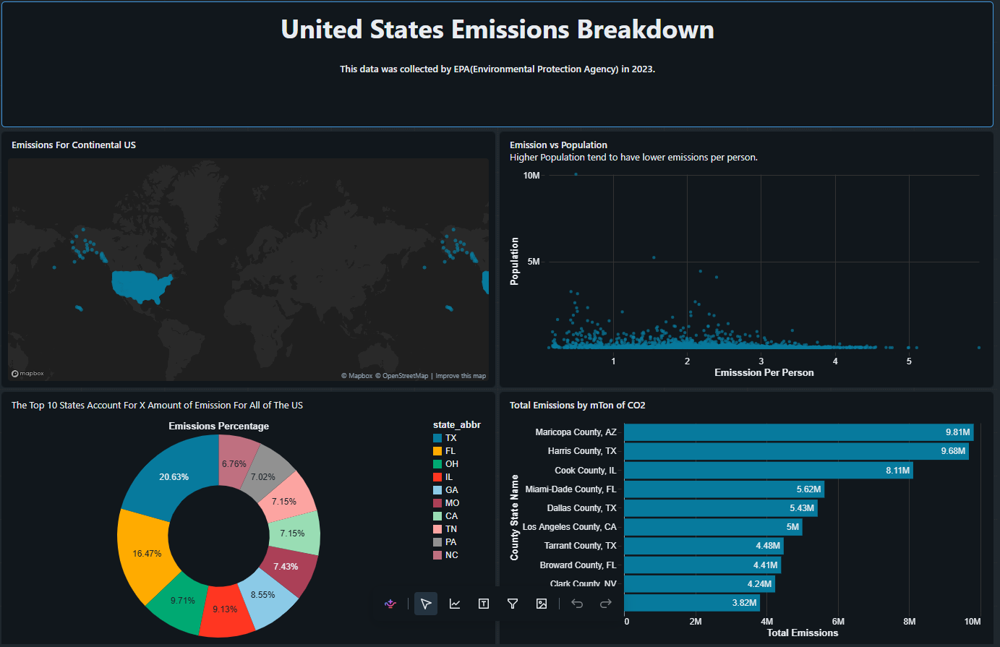
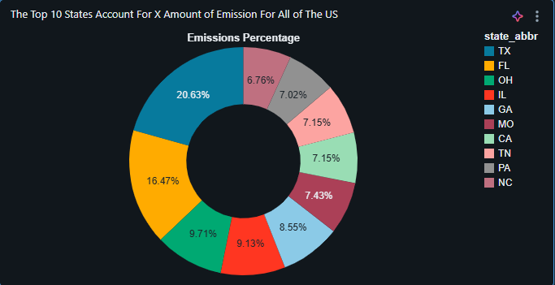
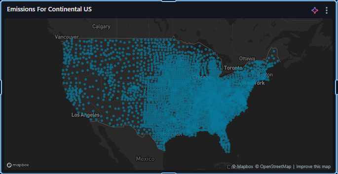

# US Emissions Dashboard

> **Interactive Data Analytics Dashboard for exploring greenhouse gas emissions across the United States**

An end-to-end data analytics project that analyzes **US greenhouse gas emissions**, population, states, and counties to identify geographic and environmental patterns. The project combines **SQL-based data analysis** with an interactive dashboard to transform raw emissions data into meaningful visual insights.

---

## 📊 Dashboard Preview



---

## 🎯 Project Objective

The main objective of this project is to analyze US emissions data and identify:

* States and counties with the highest emissions
* Geographic distribution of emissions
* Relationship between emissions and population
* Major emission patterns across the United States

The analysis helps demonstrate how data can be transformed into **clear, decision-oriented environmental insights**.

---

## 🛠️ Tech Stack

| Technology             | Purpose                      |
| ---------------------- | ---------------------------- |
| **Databricks**         | Data processing & analytics  |
| **SQL**                | Data querying and analysis   |
| **Python**             | Data processing and analysis |
| **Pandas**             | Data manipulation            |
| **Data Visualization** | Dashboard creation           |
| **GitHub**             | Project version control      |

---

## 🔄 Project Workflow

```text
Raw Emissions Data
        ↓
Data Cleaning & Preparation
        ↓
SQL Analysis
        ↓
Aggregations & Calculations
        ↓
Data Visualization
        ↓
Interactive Dashboard
        ↓
Environmental Insights
```

---

## 🔍 Key Analysis

The project performs SQL-based analysis to investigate:

### 🗺️ Emissions by Location

Analyzed emissions across different geographic regions to identify areas with higher environmental impact.

### 🏆 Top States

Identified states contributing the highest levels of emissions.



### 🌎 Emissions Distribution

Visualized the geographic distribution of emissions across the United States.



### 📈 Emissions vs Population

Compared emissions levels with population to explore how population size relates to emissions.


---

## 📌 Dashboard Insights

The dashboard provides a consolidated view of:

* **Total emissions**
* **Geographic emissions distribution**
* **Top-emitting states**
* **County-level emissions**
* **Population vs emissions patterns**

These visualizations make it easier to identify regions with significant emissions and understand broader geographic trends.

---

## 🖥️ Complete Dashboard

The complete interactive dashboard brings the major analyses together into a single view.


---

## 📂 Project Structure

```text
US-Emissions-Dashboard/
│
├── US-Emissions-Dashboard.png
├── emissions-map.png
├── Emission vs Population.png
├── top-states.png
│
├── notebooks/
│   └── SQL analysis / Databricks notebooks
│
└── README.md
```

> The exact notebook/file names may vary depending on the Databricks export.

---

## 🚀 How to Use

1. Clone the repository.

```bash
git clone https://github.com/adwingowda/US-Emissions-Dashboard.git
```

2. Open the project in your preferred environment.

3. Import the SQL/Databricks notebooks into **Databricks**.

4. Run the data preparation and analysis queries.

5. Explore the resulting dashboard and visualizations.

---

## 💡 Key Learnings

* Performed **real-world data exploration using SQL**
* Learned how to transform raw data into meaningful analytical insights
* Built visualizations for **geographic and population-based analysis**
* Developed an end-to-end **data analytics workflow**
* Practiced presenting complex datasets through an intuitive dashboard

---

## 📈 Future Improvements

* Add historical emission trend analysis
* Add year-based interactive filters
* Include emissions per capita
* Add additional county-level comparisons
* Deploy the dashboard for public access
* Automate the data refresh pipeline

---

## 👨‍💻 Author

**Adwin H S**

Information Science Engineering
Nitte Meenakshi Institute of Technology, Bangalore

---

⭐ **If you found this project interesting, consider giving the repository a star!**
